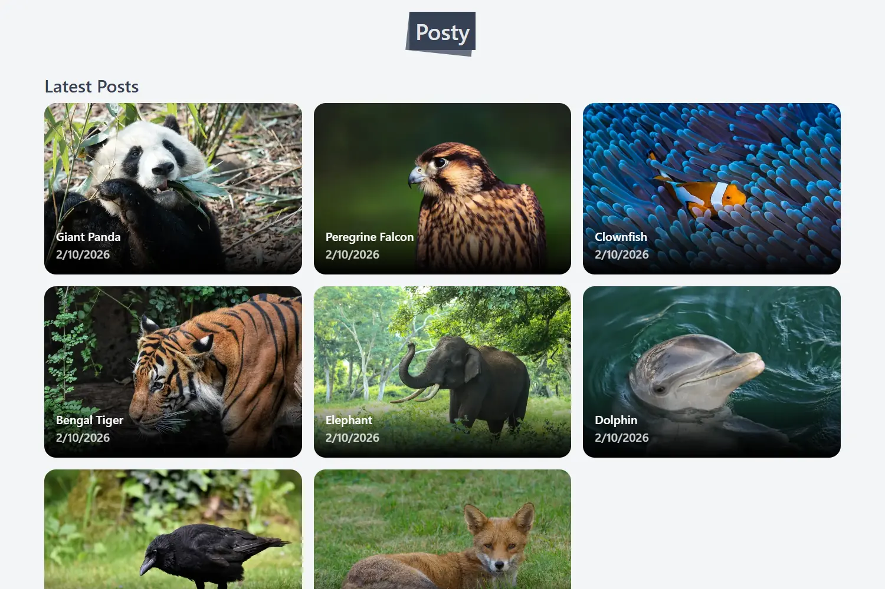
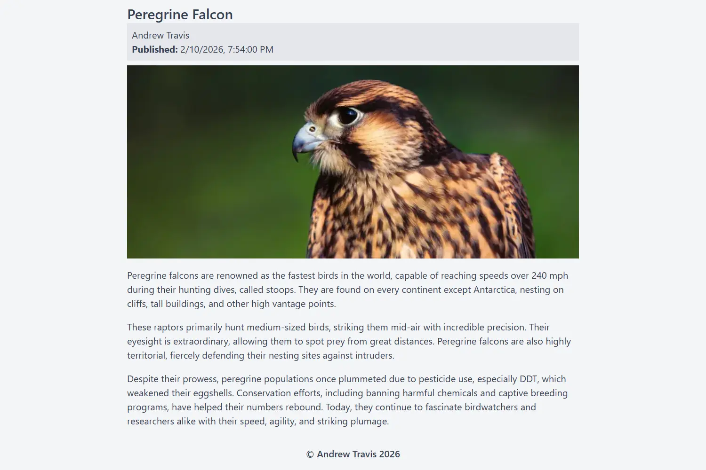

# Posty - Contentful Headless CMS App

Posty is a headless CMS web application that displays a list of the latest posts retrieved from an external Contentful API. Selecting a post navigates to a dedicated article page, where content is passed via client-side routing state. Direct navigation using an article slug in the URL dynamically fetches and renders the corresponding article content.

This project was built to practise and demonstrate modern front-end architecture using a headless CMS workflow. The primary focus was integrating and consuming the Contentful API, shaping external CMS data through custom hooks, and providing clean, reusable data consumption at the component level.

The project also served as practical experience in building responsive, accessible interfaces using Tailwind CSS, while reinforcing modern separation of concerns through a decoupled data flow pattern:

API (data fetching) --> Custom Hook (data shaping) --> Component Consumption (UI rendering)

**Live Site:**
[Posty](https://posts-headless-cms.pages.dev/)

## Concepts & Architecture Practised

- Headless CMS data consumption
- API data transformation and shaping
- Custom hook data abstraction patterns
- Decoupled data flow architecture
- Component-driven UI development
- Accessibility-first UI design
- Responsive layout implementation

## Tech Stack
- **Front End:** HTML, CSS, React, Tailwind CSS
- **Language:** TypeScript
- **Build / Dev Tools:** Vite, npm
- **Other Tools / IDE:** VSCode, Prettier, Contentful

## Screenshots

### Light Mode:
**Posts:**


**Post:**


### Dark Mode:
**Posts:**


**Post:**


## Prerequisites
- [Node.js](https://nodejs.org/) (v16 or higher recommended)

### Environment Variables
Within Contentful space:

Settings Menu > API Keys > Select API Key name

```bash
VITE_ACCESS_TOKEN=<your_contentful_delivery_api_access_token>
VITE_SPACE=<your_contentful_space_id>
```

## Installation
```bash
# Clone the repo
git clone https://github.com/AndrewAttemptsCode/posts-headless-cms.git

# Navigate into the folder
cd project-name

# Install dependencies
npm install
```

## Running the app
```bash
# Start the development server
npm run dev
```

